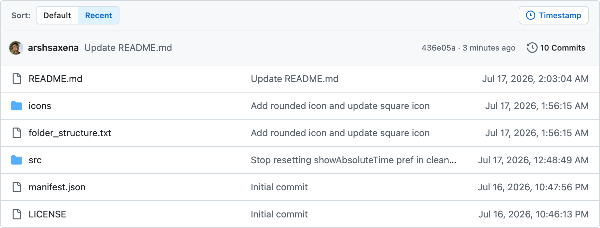

<h1>
    
    &nbsp;GitSort — GitHub Folder & File Sorter
</h1>

Quickly sort GitHub repository files and folders by their last commit date. Features a native UI, local preference memory, and absolute date toggles. Zero setup, zero tokens, 100% local.

🚀 **Sort GitHub directories instantly with zero configuration, zero tokens, and zero API calls.**

> 🔗 Looking for the Chromium version? Check out [GitSort](https://github.com/GitSort-Dev/GitSort).

---

## ✨ Features

- 🕒 **Sort by Recent**: One-click sorting to bring the most recently modified files and folders directly to the top.
- 🔄 **Restore Default**: Instantly revert back to GitHub's default layout with the click of a button.
- 📅 **Timestamp Toggle**: Switch between relative time descriptions (e.g., "3 weeks ago") and absolute local dates (e.g., `Jul 16, 2026, 8:30:36 PM`).
- ⚡ **Lightweight & Fast**: Absolute dates only calculate when you request them, ensuring zero performance overhead on load.
- 🎨 **Seamless Native UI**: Fully matches GitHub's layout and adapts to light, dark, dimmed, and high-contrast color schemes automatically.

---

## 🌐 Compatible Browser

> Requires Firefox 140 or later.

---

## 📦 Installation

1. **Download & Extract**: Download this repository as a ZIP file (or download the ZIP file from the [Releases](https://github.com/GitSort-Dev/GitSort-Firefox/releases) section) and extract it to your computer.
2. **Open Debugging**: Navigate to `about:debugging#/runtime/this-firefox` in Firefox.
3. **Load Add-on**: Click **"Load Temporary Add-on…"**.
4. **Select Manifest**: Select the `manifest.json` file from the extracted folder.
5. **Done!** Open any directory on GitHub to start sorting!

---

## 🛠️ How to Use

When browsing files on any GitHub repository, the GitSort toolbar will appear above the file list:

| Button                   | Action                                                           |
| :----------------------- | :--------------------------------------------------------------- |
| **Default**              | Restore original folders-first alphabetical order.               |
| **Recent**               | Sort files and folders by their last commit date (newest first). |
| **Timestamp / Relative** | Toggle the date format on the fly.                               |

---

## 📄 License

MIT License. Free to use and distribute.
